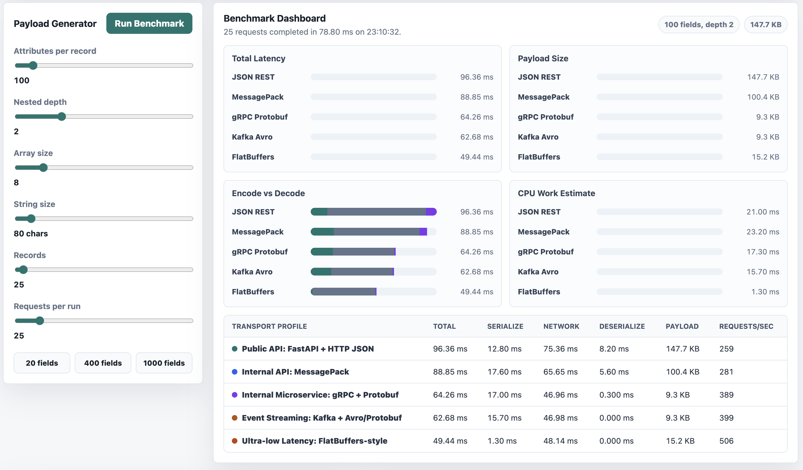

# API Transport Benchmark Lab

This small app shows why JSON is easy to use, but not always the fastest option for internal APIs or high-throughput systems.

Open `index.html`, change the payload size, and click **Run Benchmark**. The app generates a large example payload, then runs it through different transport/serialization profiles and shows:

- Total latency
- Serialization time
- Deserialization/read time
- Estimated network transfer time
- Payload size
- Requests per second

The goal is simple: see the tradeoff visually instead of only talking about it theoretically.



<br clear="left" />

## What The Formats Are

### JSON

JSON is a text format. It is human-readable, easy to debug, and works very well for public APIs.

Example:

```json
{
  "name": "Sachin",
  "age": 36
}
```

JSON is great for browser apps, REST APIs, logs, and external integrations. The downside is that it can become large and CPU-heavy when payloads grow.

### MessagePack

MessagePack is like JSON, but binary.

It keeps the same flexible data model as JSON, but stores the data in a smaller binary form. It is usually faster and smaller than JSON, and it does not require a strict schema.

Good for:

- Internal APIs
- Fast backend-to-backend communication
- Systems that want better performance without adopting a full schema system

### Protobuf

Protocol Buffers, usually called Protobuf, is a binary serialization format created by Google.

With Protobuf, you define a schema first. Then client and server code can be generated from that schema.

Good for:

- gRPC services
- Microservices
- Strongly typed APIs
- Streaming APIs
- High-performance internal systems

This is commonly used with gRPC because gRPC + Protobuf gives compact payloads, typed contracts, HTTP/2 support, and efficient service-to-service communication.

### Avro

Avro is a binary serialization format commonly used in event streaming systems.

It is popular with Kafka because it works well with schema evolution. That means producers and consumers can change data structures over time without breaking everything immediately.

Good for:

- Kafka pipelines
- Data platforms
- Event streaming
- Schema Registry based systems

In many enterprise Kafka systems, a common setup is:

```text
Kafka + Avro + Schema Registry
```

### FlatBuffers

FlatBuffers is a binary format designed for very low latency.

The big idea is that data can be read directly from the buffer without fully unpacking it into normal objects first.

Traditional flow:

```text
Network -> Deserialize -> Object -> Read
```

FlatBuffers-style flow:

```text
Network -> Read directly from buffer
```

Good for:

- Games
- Mobile apps
- Real-time systems
- Ultra-low latency reads

## Why We Are Testing Them

JSON is not bad. It is just not always the best choice.

For public APIs, JSON is still usually the right default because it is simple, readable, and universally supported.

But for internal systems, payload size and CPU cost matter more. If one service is calling another thousands of times per second, JSON can waste time on:

- Text parsing
- Larger payloads
- Serialization
- Deserialization
- Extra network bandwidth

This benchmark lets you change the payload from a small object to hundreds or thousands of fields, then compare how each approach behaves.

## What The App Tests

The app compares these profiles:

| Profile | What it represents |
| --- | --- |
| FastAPI + HTTP JSON | Public REST API style |
| MessagePack | Lightweight binary internal API |
| gRPC + Protobuf | Typed microservice communication |
| Kafka + Avro/Protobuf | Event streaming payload style |
| FlatBuffers | Ultra-low latency direct buffer reads |

The app runs in the browser, so it does not start real FastAPI, gRPC, or Kafka servers. Instead, it simulates the important parts of the comparison:

- Encoding cost
- Decoding/read cost
- Binary vs text payload size
- Estimated transfer cost
- Total request cost across many runs

That makes it lightweight and easy to open directly.

## What We Found

The results change depending on the payload settings, but the pattern is usually clear:

### JSON REST

JSON is the easiest to understand, but it usually has the largest payload and more parsing overhead.

It is best for public APIs where developer experience and compatibility matter more than raw speed.

### MessagePack

MessagePack usually improves payload size and latency compared with JSON.

It is a strong option when you want a quick performance win without moving to a strict schema like Protobuf.

### gRPC + Protobuf

The Protobuf-style profile usually performs better than JSON and MessagePack for structured data.

The main benefit is that the schema makes the payload compact and predictable. This is why gRPC + Protobuf is a common choice for internal microservices.

### Kafka + Avro/Protobuf

Kafka-style encoding is useful when the data is an event moving through a pipeline.

It may not always be the lowest-latency option in this demo because event systems include extra metadata and durability concerns, but it is excellent for streaming, replay, and schema evolution.

### FlatBuffers

FlatBuffers-style encoding usually gives the best read-side latency in this demo.

The key advantage is direct buffer access. Instead of decoding the full object, the app can read specific values from the binary buffer.

This is why FlatBuffers is useful for games, mobile, and other real-time systems where avoiding extra object creation matters.

## Simple Recommendation

Use this rule of thumb:

| Situation | Recommended choice |
| --- | --- |
| Public API | HTTP + JSON |
| Easy internal binary format | MessagePack |
| Internal microservices | gRPC + Protobuf |
| Kafka/event streaming | Avro or Protobuf |
| Ultra-low latency reads | FlatBuffers |

## Important Note About JSONB

JSONB is different from all of these.

JSONB is a PostgreSQL storage format. It helps inside the database with indexing and querying JSON-like data.

It is not an API transport format.

```text
Client -> JSON over HTTP -> API -> PostgreSQL JSONB storage
```

So JSONB can help with database queries, but it does not remove API serialization or deserialization cost.
